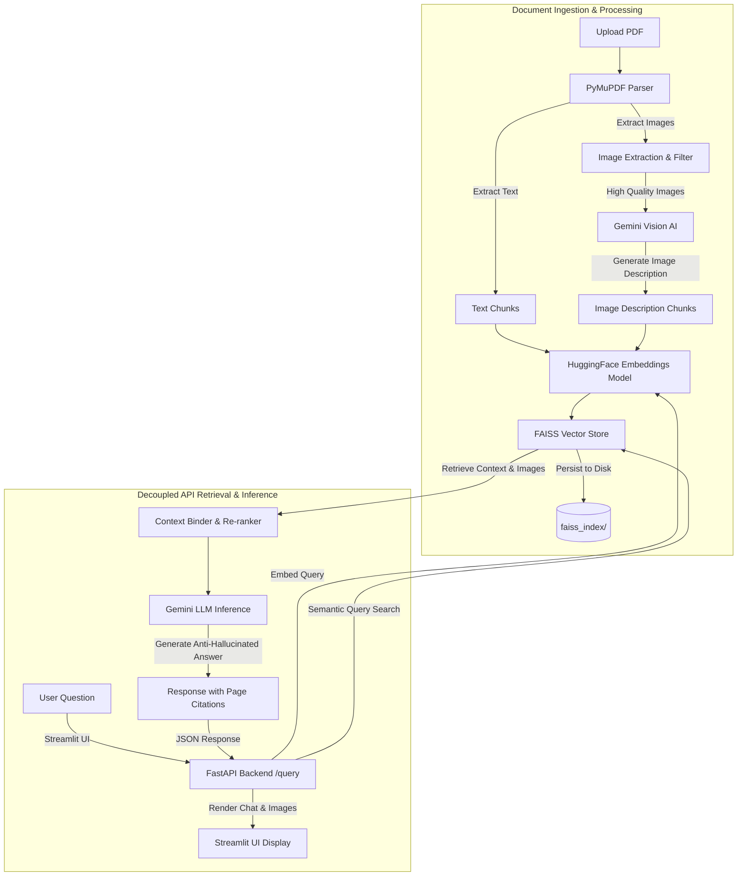

# Visual RAG PDF Chatbot (Multimodal) 🤖📄🖼️

A state-of-the-art **Multimodal Retrieval-Augmented Generation (RAG)** application designed to analyze PDF documents. It goes beyond simple text retrieval by automatically parsing, understanding, and citing visual elements like diagrams, flowcharts, schemas, and tables using Gemini Vision AI.

The backend is fully decoupled via **FastAPI** with persistent **FAISS Vector DB** storage, and the user interface is built on **Streamlit** with a high-end customized design system.

---

## 📐 System Architecture

The following diagram illustrates the complete multimodal pipeline, from document processing to query retrieval and response generation:



---

## ✨ Key Features

1. **Multimodal Analysis (Visual RAG):** Automatically extracts diagrams, charts, and tables from PDFs. Uses Vision AI to generate high-fidelity technical descriptions of these visual aids, enabling semantic search to index and retrieve image content.
2. **Decoupled Architecture:** High-performance **FastAPI** backend exposing REST endpoints, separation of UI rendering and heavy pipeline logic.
3. **FAISS Vector Store with Disk Persistence:** Saves indices locally on the disk. Restarts do not require re-indexing, boosting performance for repeated analysis.
4. **API Robustness & Rate-Limit Handling:** Implements exponential backoff logic for Gemini API queries, avoiding 429/503 errors under high traffic.
5. **Quantitative Evaluation Suite:** Features a built-in evaluation framework (`evaluation/eval_rag.py`) acting as an LLM-as-a-judge to measure precision, recall of sources, correctness, and faithfulness.
6. **Premium UI/UX:** Stunning Streamlit UI featuring Outfit typography, smooth animations, interactive stats cards, and citations displaying original figures.

---

## 🛠️ Tech Stack

* **Frontend:** Streamlit
* **Backend:** FastAPI + Uvicorn
* **Orchestration:** LangChain (Recursive Text Splitter, Document objects)
* **Embeddings:** HuggingFace Embeddings (`all-MiniLM-L6-v2`)
* **Vector Store:** FAISS (CPU version with local persistence)
* **LLM & Vision:** Google Gemini API (`models/gemini-3.1-flash-lite`, `models/gemini-2.5-flash-lite`)
* **PDF Parser:** PyMuPDF (`fitz`)
* **Testing & Eval:** pytest, Python Logging

---

## 🚀 Setup & Installation

### 1. Prerequisites
Ensure you have Python 3.10+ installed.

### 2. Clone and Install Dependencies
```bash
# Clone the repository
cd Visual-RAG-PDF-Chatbot-main

# Create virtual environment
python -m venv venv
source venv/bin/activate  # On Windows: venv\Scripts\activate

# Install requirements
pip install -r requirements.txt
```

### 3. Environment Configuration
Create a `.env` file in the root directory (based on `.env.example`):
```ini
GEMINI_API_KEY=your_gemini_api_key_here
API_URL=http://localhost:8000
```

### 4. Running the Application

You can run the backend API and frontend UI concurrently:

**Start the FastAPI Backend:**
```bash
uvicorn api:app --host 0.0.0.0 --port 8000
```

**Start the Streamlit Frontend:**
```bash
streamlit run app.py
```
Open your browser at `http://localhost:8501`.

---

## 📊 Quantitative Evaluation

Run the evaluation script to test the RAG performance quantitatively using ground-truth question-answer-page pairs:

```bash
python evaluation/eval_rag.py
```
This script computes:
* **Retrieval Recall:** Was the correct page retrieved for the query?
* **Answer Correctness:** Rating 1-5 by LLM-as-a-judge.
* **Faithfulness:** Rating 1-5 by LLM-as-a-judge.

---

## 📦 Containerization with Docker

You can run the entire application inside Docker.

**Build the Docker Image:**
```bash
docker build -t visual-rag-chatbot .
```

**Run the Container:**
```bash
docker run -p 8501:8501 -p 8000:8000 --env-file .env visual-rag-chatbot
```
This runs both the FastAPI server and Streamlit frontend inside a single container using a startup script.
